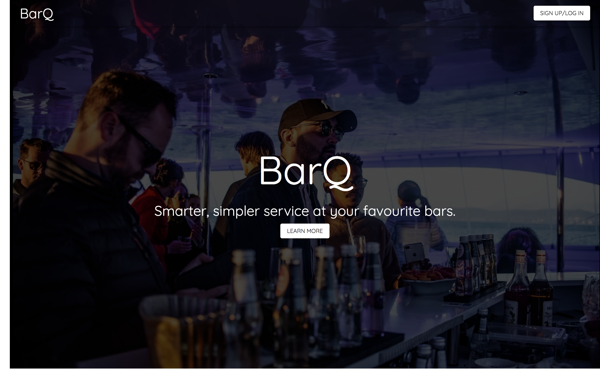
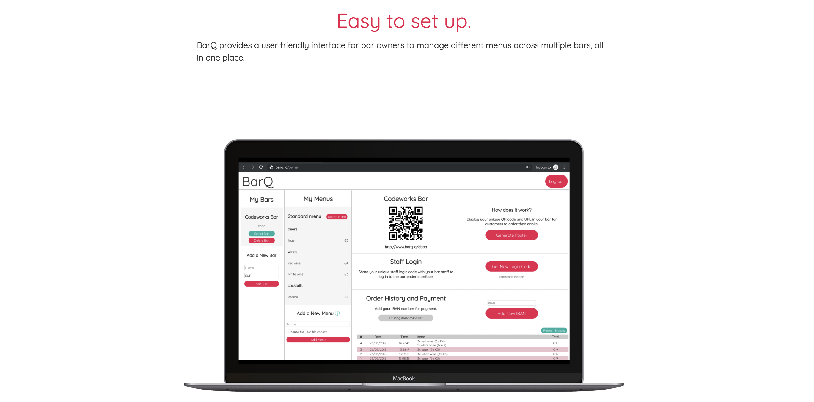

# BarQ
*Streamlined order and payments management for bars and pubs*

BarQ allows you to order and pay for drinks from your phone wherever you are in the bar. No more fighting through crowds and waiting to catch a bartenders' attention. Browse the menu and place your order without leaving your seat. You’ll be notified as soon as your order is ready to pick up.

BarQ provides a user friendly interface for bar owners to manage different menus across multiple bars, all in one place.

A live feed of current orders shows you what to prepare next. You can update the status of orders with one click, sending live updates to let your customer know when their drink is ready.

## Getting Started
Each of the interfaces (Customer, Staff, and Admin) is a separate React app and expects to connect with the [BarQ Server](https://github.com/felixweinberger/barq-server).

1. Clone the this repo and the [BarQ server](https://github.com/felixweinberger/barq-server) where you want them
2. Rename the `.env.example` files in `/customer` and `/staff` to `.env` and fill in necessary fields
3. Run BarQ server with `docker-compose` (check the [BarQ server repository](https://github.com/felixweinberger/barq-server) for further details).
4. Double check that the BarQ server directory is named `barq-server` (this is to ensure that the front-end finds the correct docker network)
5. In `/barq-client`, run `docker-compose build`
6. In `/barq-client`, run `docker-compose up`

## Tech Stack
### Customer
- React
- Redux
- Axios
- Socket.io-client

### Staff
- React
- Redux
- Axios
- Socket.io-client

### Admin
- React
- Materialize

### Server
- Node.js
- Express
- MongoDB
- Socket.io-server

## Contributors
- Natalia Rizzi
- Egill Hreinsson
- Alan Hu
- Felix Weinberger
- Rachel Bonny
